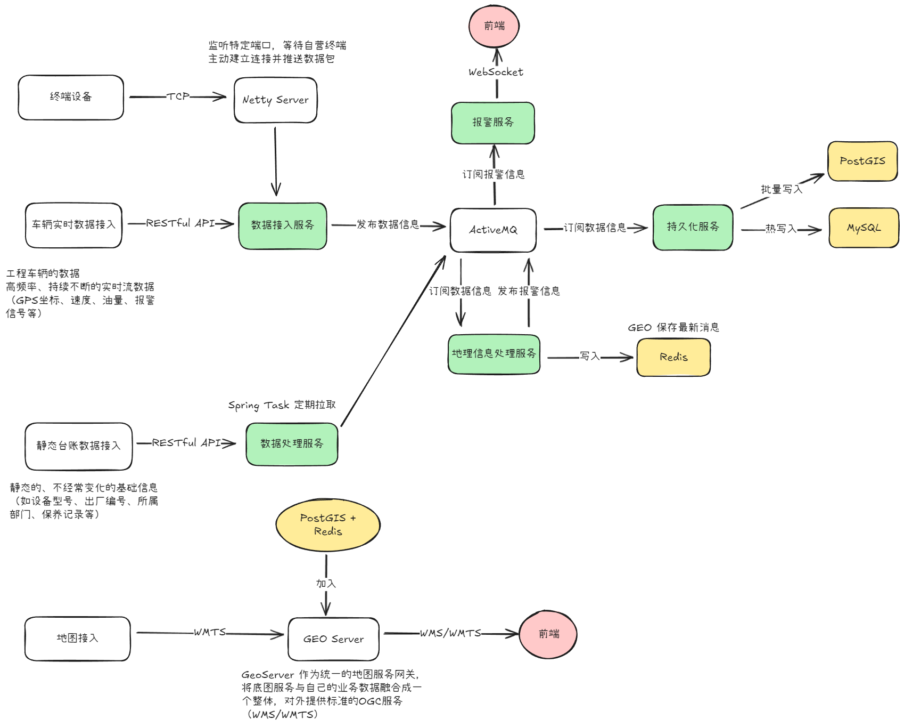

A project of custom-changed backend.

### 数据接入服务
这个模块拥有两个输入
- 自研无人矿卡：按时间自动向服务器推送
- 有人矿卡：通过 RESTful API 调用，有条件（比较Id与时间戳确认是否更新）定时拉取

这个服务会将得到的信息推送到 ActiveMQ 消息队列。采用设备ID作为区分键，直接发布到 raw 的主题中（以 JSON 格式）。

### 地理信息处理服务
输入为从消息队列中订阅的 raw 信息
- 将接收到的消息解析为 VehicleData 对象
- 使用 Lua 脚本原子性地缓存到 Redis
- **有一个查询周围设备的逻辑**
    - 当某一个设备的位置更新时，进行一次查询周围设备的操作
    - 如果距离过近，则报警
- 判断是否出现报警事件（上传的报警以及后端计算的报警）

向消息队列发布报警信息

### 持久化服务
向消息队列订阅 raw 信息的 topic
- 实时向 MySQL 写入调度信息（在线、分组）
- 分批向 PostGIS 写入位置信息

### 报警服务
从消息队列订阅报警 topic 然后通过 WebSocket 向前端推送
